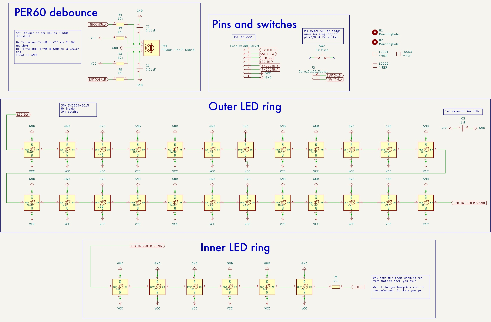

# Ultrafalcon
### This PCB has been generously sponsored by...

...my thanks to them!

## 'what if'
What if you could have a giant clacky center button on your giant encoder wheel that's a TFT and surrounded by LEDs?

Well, this is that. (_TFT optional, not on-board the PCB_)

The Ultrafalcon is my re-imagining of Casuanoob's [Falcon EC-11 pcb](https://github.com/Bastardkb/Charybdis-EC11), which I have used extensively on several builds.

With this pcb you get...
- Bourns PER60 encoder w. debounce circuit
- MX switch cutout (_or, passthrough for whatever else you mount in the middle_)
- Fitment for large 77mm or larger encoder handwheel
- 30 programmable SK6805-ER15 LEDs (_e.g. use with QMK's rgb matrix_) w. LED signal passthrough (_DI and DO pins_)
 - 24 on the outside of the encoder (_b/c 24 is twice 12...?_)
 - 6 on the inside of the encoder (_b/c two rings of illumination are better than one?_)
- 330ohm resistor on the DI line (datasheet recommendation)
- 1uF capacitor (_help avoid capacitance_)
- JST-XH 2.54 footprint (_or, just 8 through-holes spaced at 2.54mm_)

Also included are the relevant STL and Fusion files to get you started on including this in your build.

# Mounting to your shell
My current method is to use a static "interface" part that gets combined into the forms shell.  Then the rest of your important pieces locate onto the "interface" part and everything works out swell.  Usually.

# not-included-in-the-PCB-details
I'll be using a GC9A01 circular 1.28" TFT and QMK's quantum painter feature.  The TFT uses an 8-pin 0.5mm pitch FPC cable

# PCB details

The goal of this design was to provide a larger encoder wheel experience, and while doing that, why not add more LEDs? ... annnd while doing that, maybe add the capability of "room for activities" inside the encoder wheel.

Some of the existing Falcon issues I have are mostly centered on the fact that the EC-11 package was never meant to mount a super huge wheel, so you get wobble and tilt, and it generally just feels not quite right.  Further, the pcb was designed to fit the wonderful Charybdis keyboard, so has some packaging constraints that are unfortunate when not using a Charybdis! (_e.g. pin headers not on same axis_)

There's also no debounce as-is, though I'm sure something could be added.  The software debounce helps but you still run into issues from time to time.

So, being new to pcb design, I gave it a shot.
- dual ground planes (_2-layer board_)
- via 'ties' to keep ground as contiguous as possible
- 0.4mm power traces / 0.25mm data traces
- avoiding running power/data together as much as possible
- datasheets provide the source of design truth
- capacitor on-board to help with capacitance issues
- M3 mounting holes w. plating
- MX-size cutout (_plus another cutout for FPC cable/mounting block locator_)

# Schematic
- PER60 debounce circuit
 - 4x 10k ohm resistors
 - 2x 0.01uF capacitors
- 1uF capacitor for LED supply
- 330 ohm resistor for LED DI pin
- NOTE: no capacity to wire the MX switch via the PCB, you must run wires direct to the pins

